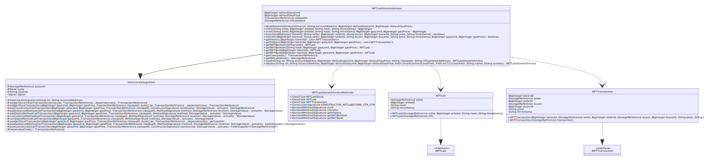
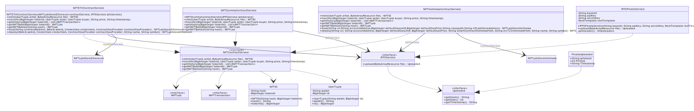

# Smart contract java integration
[](https://coveralls.io/github/NFT-Lab/smart-contract-integration?branch=main)
[](https://github.com/NFT-Lab/smart-contract-ethereum-web3j-integration/actions/workflows/build.yml)

La seguente repository contiene la libreria che permette la comunicazione da java con lo smart contract NFTLabStore per Hotmoka ed Ethereum, per la gestione della compra vendita di NFT nella piattaforma NFTLab.

## Strumenti utilizzati

* **[Maven](https://maven.apache.org/).**
* **[JUnit5](https://junit.org/junit5/):** libreria per la scrittura di test nel linguaggio java.
* **[Mockito](https://site.mockito.org/):** libreria per la scrittura di mock utilizzabili ed integrabili con **JUnit5**.
* **[Solc](https://github.com/ethereum/solidity):** compilatore per solidity.
* **[Web3J](https://www.web3labs.com/web3j-sdk):** libreria per l'interazione con la blockchain Ethereum.
* **[Pinata](https://pinata.cloud/):** servizio che offre l'accesso alla rete IPFS.
* **[Coveralls](https://coveralls.io/github/NFT-Lab/smart-contract-ethereum?branch=main):** servizio che permette di avere il report del code coverage raggiunto.

## Prerequisiti
1. Creare un token personale che permetta la lettura di pacchetti da github ([la guida qui](https://docs.github.com/en/github/authenticating-to-github/keeping-your-account-and-data-secure/creating-a-personal-access-token)).

2. Creare il file **settings.xml** dentro la cartella **~/.m2** con il seguente contenuto:
```xml
<settings xmlns="http://maven.apache.org/SETTINGS/1.0.0"
     xmlns:xsi="http://www.w3.org/2001/XMLSchema-instance"
     xsi:schemaLocation="http://maven.apache.org/SETTINGS/1.0.0
                         http://maven.apache.org/xsd/settings-1.0.0.xsd">

     <activeProfiles>
       <activeProfile>github</activeProfile>
     </activeProfiles>

     <profiles>
       <profile>
         <id>github</id>
         <repositories>
           <repository>
             <id>central</id>
             <url>https://repo1.maven.org/maven2</url>
           </repository>
           <repository>
             <id>github</id>
             <url>https://maven.pkg.github.com/NFT-Lab/*</url>
             <snapshots>
               <enabled>true</enabled>
             </snapshots>
           </repository>
         </repositories>
       </profile>
     </profiles>

     <servers>
       <server>
         <id>github</id>
         <username>$GITHUB_USERNAME</username>
         <password>$ACCESS_TOKEN</password>
       </server>
     </servers>
</settings>
```

In questo modo si permetterà a maven di accedere alla repository maven di github.

3. Eseguire i seguenti comandi per installare Hotmoka 1.0.0:

   ```bash
   $ git clone https://github.com/Hotmoka/hotmoka.git
   $ cd hotmoka
   $ git checkout 1.0.0
   $ mvn cleaninstall
   ```

   

## Organizzazione della repository

```bash
├── LICENSE
├── pom.xml
├── README.md
├── smart-contract-ethereum
├── smart-contract-integration.iml
├── sol-to-java.sh
└── src
    ├── main
    │   └── java
    │       └── io
    │           └── nfteam
    │               └── nftlab
    │                   ├── contracts
    │                   │   ├── hotmoka
    │                   │   │   ├── HotmokaIntegration.java
    │                   │   │   └── NFTLabStoreHotmokaMethods.java
    │                   │   ├── NFTLabStoreEthereum.java
    │                   │   └── NFTLabStoreHotmoka.java
    │                   └── services
    │                       ├── ipfs
    │                       │   ├── PinataUploaded.java
    │                       │   ├── IPFSPinataService.java
    │                       │   ├── IPFSUploaded.java
    │                       │   └── IPFSService.java
    │                       ├── NFTContractService.java
    │                       ├── NFTDummyContractService.java
    │                       ├── NFTETHContractService.java
    │                       ├── NFTHotmokaContractService.java
    │                       └── smartcontract
    │                           ├── INFTLab.java
    │                           ├── INFTTransaction.java
    │                           ├── NFTID.java
    │                           └── UserTuple.java
    └── test
        └── java
            └── io
                └── nfteam
                    └── nftlab
                        └── services
                            ├── ipfs
                            │   ├── IPFSPinataServiceTest.java
                            │   └── PinataUploadedTest.java
                            ├── NFTDummyContractServiceTest.java
                            ├── NFTETHContractServiceTest.java
                            ├── NFTHotmokaContractServiceTest.java
                            └── smartcontract
                                ├── NFTIDTest.java
                                └── UserTupleTest.java

```


### Package io.nfteam.nftlab

#### Contracts

##### NFTLabStoreEthereum

Classe che gestisce l'interazione con la blockchain Ethereum. Viene autogenerata dallo strumento **Web3J**, il quale dovrà essere installato nel proprio pc ([la guida qui](http://docs.web3j.io/latest/quickstart/)), a partire dall'ABI dello smart contract, il quale sarà ottenuto attraverso il compilatore solc ([disponibile qui](https://github.com/ethereum/solidity/releases)). Per comodità è stato creato lo script **sol-to-java.sh** che, dato il path allo smart contract, genera automaticamente la classe **NFTLabStoreEthereum** all'interno del package **io.nfteam.nftlab.contracts**.

Esempio di esecuzione:

```bash
$ ./sol-to-java.sh ./smart-contract-ethereum/contracts/NFTLabStore.sol
```

##### NFTLabStoreHotmoka



Classe che gestisce l'interazione con la blockchain Hotmoka. Al contrario della classe precedente, questa è stata scritta a mano data la mancanza di uno strumento come Web3J per il linguaggio Takamaka. Per aiutare la scrittura della seguente classe, è stata creata una classe astratta chiamata **HotmokaIntegration**, la quale espone del metodi che facilitano la scrittura delle funzioni per l'integrazione con la blockchain.

#### Services



##### IPFSService

Consiste nell'interfaccia che permette di definire un servizio per accedere a IPFS.

###### Metodi

- **Uploaded upload(ByteArrayResource file):** accetta la sequenza di byte che consiste in un file e li carica sulla rete IPFS.

##### IPFSPinataService

Specializzazione della classe **IPFSService** e comunica con il servizio IPFS Pinata.

###### Costruttori

- **IPFSPinataService(String baseUrl, String apiKey, String secretKey, RestTemplate restTemplate)**

##### NFTContractService

Consiste nell'interfaccia che permettere di definire un servizio per accedere ad una blockchain e interagire con lo smart contract **NFTLabStore**. Ogni file verrà salvato nella rete IPFS, da cui riceveremo anche il codice hash univoco, il quale verrà in seguito memorizzato nella blockchain.

###### Metodi

* **mint(UserTuple artist, ByteArrayResource file) NFTID:** per eseguire la creazione di un nuovo NFT si necessità della tupla dell'artista (wallet, id dell'utente nel DB) e il file da cui generare il NFT. Ritorna la tupla (hash, id del token salvato nella blockchain).
* **transfer(BigInteger tokenId, UserTuple seller, UserTuple buyer, String price, String timestamp)**
* **getHistory(BigInteger tokenId) List\<NFTTransaction\>**
* **getNFTById(BigInteger tokenId) INFTLab**
* **getNFTByHash(String hash) INFTLab**

##### NFTDummyContractService

Classe che non comunica con la blockchain, ma memorizza solamente i file su IPFS. Ad ogni **mint** il tokenId del NFT sarà impostato a -1.

###### Costruttori

- **NFTDummyContractService(IPFSService ipfsService)**

##### NFTETHContractService

Classe che interagisce con la classe **NFTLabStoreEthereum** ed esegue le operazioni sulla blockchain Ethereum.

###### Costruttori

- **NFTETHContractService(NFTLabStoreEthereum contractService, IPFSService ipfsService)**

###### Metodi statici

- **load(String contractAddress, Web3j web3j, Credentials credentials, ContractGasProvider contractGasProvider):** carica uno smart contract già esistente nella blockchain:
  - **contractAddress:** indirizzo dello smart contract
  - **web3j:** connessione alla blockchain
  - **credentials:** credenziali a partire dalla chiave privata
  - **contractGasProvider:** definizione dell'oggetto che gestirà il gas 
- **deploy(Web3j web3j, Credentials credentials, ContractGasProvider contractGasProvider, String name, String symbol):** 
  - **web3j:** connessione alla blockchain
  - **credentials:** credenziali a partire dalla chiave privata
  - **contractGasProvider:** definizione dell'oggetto che gestirà il gas 
  - **name:** nome del NFT
  - **symbol:** simbolo del NFT

##### NFTHotmokaContractService

Classe che interagisce con la classe **NFTLabStoreHotmoka** ed esegue le operazioni sulla blockchain Hotmoka.

###### Costruttori

- **NFTHotmokaContractService(NFTLabStoreHotmoka contractService, IPFSService ipfsService)**

###### Metodi statici

- **load(String url, String accountAddress, BigInteger defaultGasLimit, BigInteger defaultGasPrice, String classpath, String nftLabStoreAddress):**
  - **url:** indirizzo della blockchain
  - **accountAddress:** indirizzo del proprio account
  - **defaultGasLimit:** gasLimit di default
  - **defaultGasPrice:** gasPrice di default
  - **classpath:** indirizzo del blocco dove è stato memorizzato il JAR dello smart contract
  - **nftLabStoreAddress:** indirizzo del blocco dove è memorizzato l'oggetto NFTLabStore
- **deploy(String url, String accountAddress, BigInteger defaultGasLimit, BigInteger defaultGasPrice, String smartContractHotmokaPath, String erc721HotmokaPath, String name, String symbol):**
  - **url:** indirizzo della blockchain
  - **accountAddress:** indirizzo del proprio account
  - **defaultGasLimit:** gasLimit di default
  - **defaultGasPrice:** gasPrice di default
  - **smartContractHotmokaPath:** path al JAR dello smart contract da caricare
  - **erc721HotmokaPath:** path al JAR dello standard ERC721
  - **name:** nome del NFT
  - **symbol:** simbolo del NFT
#### Test

Tutti i test sono stati implementati attraverso le librerie **Junit5** e **Mockito**.

## Continuous Integration

### Build

Viene eseguita dalla action presente nel file **build.yml** ad ogni push nel **main** o nel **develop** e ha il compito di compilare, eseguire i test e inviare il report del code coverage a **coveralls**.

### Publish to github packages

Viene eseguita dalla action presente nel file **publish-to-github-packages.yml** ad ogni creazione di una nuova release e ha il compito di pubblicare l'artefatto maven nella repository maven dell'organizzazione NFT-Lab ([https://github.com/orgs/NFT-Lab/packages](https://github.com/orgs/NFT-Lab/packages)).